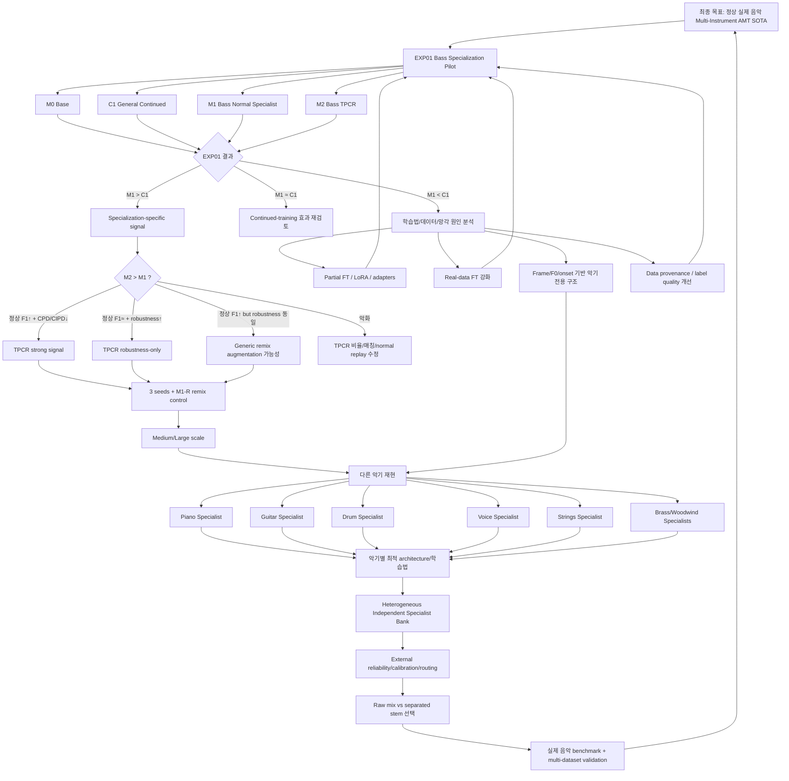
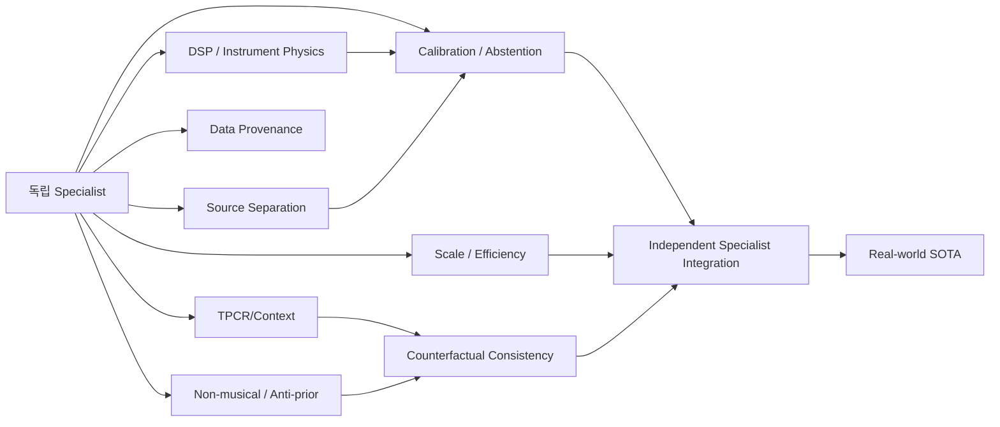

# 독립 악기별 Specialist AMT 전체 연구 로드맵

## 병렬 연구축

## 논문 후보

1. **Do Instrument Specialists Beat Universal Music Transcription Models?**
2. **Cross-Instrument Context Dependence in Multi-Instrument AMT**
3. **Target-Preserving Context Replacement for Robust AMT**
4. **Counterfactual Consistency Training for Instrument Transcription**
5. **Breaking the Music Prior: Non-Musical Curriculum Learning for AMT**
6. **Ground-Truth Reliability and Data Provenance in Large-Scale AMT**
7. **Reliability-Aware Independent Specialist Integration for Multi-Instrument AMT**
8. **Instrument-Physics-Constrained AMT**

상세 실험 120개와 모든 결과 분기는 `master-plan/`에 있다.
